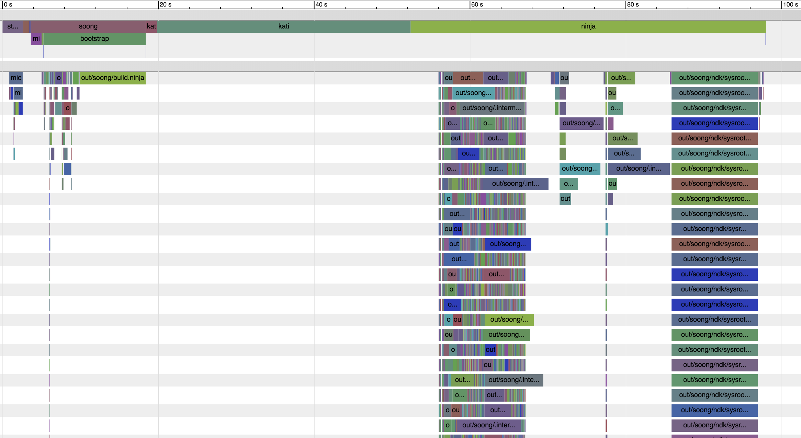

# Build Performance

## Debugging Build Performance

### Tracing

soong_ui has tracing built in, so that every build execution's trace can be
viewed.  Just open `$OUT_DIR/build.trace.gz` in Chrome's <chrome://tracing>, or
with [catapult's trace viewer][catapult trace_viewer]. The last few traces are
stored in `build.trace.#.gz` (larger numbers are older). The associated logs
are stored in `soong.#.log`.



### Soong

Soong can be traced and profiled using the standard Go tools. It understands
the `-cpuprofile`, `-trace`, and `-memprofile` command line arguments, but we
don't currently have an easy way to enable them in the context of a full build.

### Kati

In general, the slow path of reading Android.mk files isn't particularly
performance sensitive, since it doesn't need to happen on every build. It is
important for the fast-path (detecting whether it needs to regenerate the ninja
file) to be fast however. And it shouldn't hit the slow path too often -- so
don't rely on output of a `$(shell)` command that includes the current timestamp,
or read a file that's going to change on every build.

#### Regen check is slow

In most cases, we've found that the fast-path is slow because all of the
`$(shell)` commands need to be re-executed to determine if their output changed.
The `$OUT_DIR/soong.log` contains statistics from the regen check:

```
.../kati.go:127: *kati*: regen check time: 1.699207
.../kati.go:127: *kati*: glob time (regen): 0.377193 / 33609
.../kati.go:127: *kati*: shell time (regen): 1.313529 / 184
.../kati.go:127: *kati*:  0.217 find device vendor -type f -name \*.pk8 -o -name verifiedboot\* -o -name \*.x509.pem -o -name oem\*.prop | sort
.../kati.go:127: *kati*:  0.105 cd packages/apps/Dialer ; find -L . -type d -name "res"
.../kati.go:127: *kati*:  0.035 find device vendor -maxdepth 4 -name '*_aux_variant_config.mk' -o -name '*_aux_os_config.mk' | sort
.../kati.go:127: *kati*:  0.029 cd frameworks/base ; find -L  core/java graphics/java location/java media/java media/mca/effect/java media/mca/filterfw/java media/mca/filterpacks/java drm/java opengl/java sax/java telecomm/java telephony/java wifi/java lowpan/java keystore/java rs/java ../opt/telephony/src/java/android/telephony ../opt/telephony/src/java/android/telephony/gsm ../opt/net/voip/src/java/android/net/rtp ../opt/net/voip/src/java/android/net/sip   -name "*.html" -and -not -name ".*"
.../kati.go:127: *kati*:  0.025 test -d device && find -L device -maxdepth 4 -path '*/marlin/BoardConfig.mk'
.../kati.go:127: *kati*:  0.023 find packages/apps/Settings/tests/robotests -type f -name '*Test.java' | sed -e 's!.*\(com/google.*Test\)\.java!\1!' -e 's!.*\(com/android.*Test\)\.java!\1!' | sed 's!/!\.!g' | cat
.../kati.go:127: *kati*:  0.022 test -d vendor && find -L vendor -maxdepth 4 -path '*/marlin/BoardConfig.mk'
.../kati.go:127: *kati*:  0.017 cd cts/tests/tests/shortcutmanager/packages/launchermanifest ; find -L  ../src -name "*.java" -and -not -name ".*"
.../kati.go:127: *kati*:  0.016 cd cts/tests/tests/shortcutmanager/packages/launchermanifest ; find -L  ../../common/src -name "*.java" -and -not -name ".*"
.../kati.go:127: *kati*:  0.015 cd libcore && (find luni/src/test/java -name "*.java" 2> /dev/null) | grep -v -f java_tests_blacklist
.../kati.go:127: *kati*: stat time (regen): 0.250384 / 4405
```

In this case, the total time spent checking was 1.69 seconds, even though the
other "(regen)" numbers add up to more than that (some parts are parallelized
where possible). The biggest contributor is the `$(shell)` times -- 184
executions took a total of 1.31 seconds. The top 10 longest shell functions are
printed.

All the longest commands in this case are all variants of a call to `find`, but
this is where using pure make functions instead of calling out to the shell can
make a performance impact -- many calls to check if `26 > 20` can add up. We've
added some basic math functions in `math.mk` to help some common use cases that
used to be rather expensive when they were used too often.

There are some optimizations in place for find commands -- if Kati can
understand the find command, the built-in find emulator can turn some of them
into glob or stat checks (falling back to calling `find` if one of those imply
that the output may change). Many of the common macros produce find commands
that Kati can understand, but if you're writing your own, you may want to
experiment with other options if they're showing up in this list. For example,
if this was significantly more expensive (either in runtime, or was called
often):

```
.../kati.go:127: *kati*:  0.015 cd libcore && (find luni/src/test/java -name "*.java" 2> /dev/null) | grep -v -f java_tests_blacklist
```

It may be more efficient to move the grep into make, so that the `find` portion
can be rewritten and cached:

```
$(filter-out $(file <$(LOCAL_PATH)/java_tests_blacklist),$(call all-java-files-under,luni/src/test/java))
```

Others can be simplified by just switching to an equivalent find command that
Kati understands:

```
.../kati.go:127: *kati*:  0.217 find device vendor -type f -name \*.pk8 -o -name verifiedboot\* -o -name \*.x509.pem -o -name oem\*.prop | sort
```

By adding the implicit `-a` and moving the `| sort` to Make, this can now be
cached by Kati:

```
$(sort $(shell find device vendor -type -f -a -name \*.pk8 -o -name verifiedboot\* -o -name \*.x509.pem -o -name oem\*.prop))
```

Kati is learning about the implicit `-a` in [this change](https://github.com/google/kati/pull/132)

#### Kati regens too often

Kati prints out what triggered the slow path to be taken -- this can be a
changed file, a changed environment variable, or different output from a
`$(shell)` command:

```
out/soong/Android-aosp_arm.mk was modified, regenerating...
```

The state is stored in `$OUT_DIR/.kati_stamp*` files, and can be (partially)
read with the `ckati_stamp_dump` tool in prebuilts/build-tools. More debugging
is available when ckati is run with `--regen_debug`, but that can be a lot of
data to understand.

### Ninja

#### Understanding why something rebuilt

Add `NINJA_ARGS="-d explain"` to your environment before a build, this will cause
ninja to print out explanations on why actions were taken. Start reading from the
beginning, as this much data can be hard to read:

```
$ cd art
$ mma
$ touch runtime/jit/profile_compilation_info.h
$ NINJA_ARGS="-d explain" mma
...
ninja explain: output out/soong/.intermediates/art/tools/cpp-define-generator/cpp-define-generator-data/linux_glibc_x86_64/obj/art/tools/cpp-define-generator/main.o older than most recent input art/runtime/jit/profile_compilation_info.h (
1516683538 vs 1516685188)
ninja explain: out/soong/.intermediates/art/tools/cpp-define-generator/cpp-define-generator-data/linux_glibc_x86_64/obj/art/tools/cpp-define-generator/main.o is dirty
ninja explain: out/soong/.intermediates/art/tools/cpp-define-generator/cpp-define-generator-data/linux_glibc_x86_64/cpp-define-generator-data is dirty
ninja explain: out/soong/host/linux-x86/bin/cpp-define-generator-data is dirty
ninja explain: out/soong/.intermediates/art/tools/cpp-define-generator/cpp-define-generator-asm-support/gen/asm_support_gen.h is dirty
ninja explain: out/soong/.intermediates/art/cmdline/art_cmdline_tests/android_arm_armv7-a_core_cmdline_parser_test/obj/art/cmdline/cmdline_parser_test.o is dirty
...
```

In this case, art/cmdline/cmdline_parser_test.o was rebuilt because it uses
asm_support_gen.h, which was generated by cpp-define-generator-data, which uses
profile_compilation_info.h.

You'll likely need to cross-reference this data against the build graph in the
various .ninja files. The files are (mostly) human-readable, but a (slow) web
interface can be used by running `NINJA_ARGS="-t browse <target>" m`.

#### Builds take a long time

If the long part in the trace view of a build is a relatively solid block, then
the performance is probably more related to how much time the actual build
commands are taking than having extra dependencies, or slowdowns in
soong/kati/ninja themselves.

Beyond looking at visible outliers in the trace view, we don't have any tooling
to help in this area yet. It's possible to aggregate some of the raw data
together, but since our builds are heavily parallelized, it's particularly easy
for build commands to impact unrelated build commands. This is an area we'd
like to improve -- we expect keeping track of user/system time per-action would
provide more reliable data, but tracking some full-system data (memory/swap
use, disk bandwidth, etc) may also be necessary.

## Known Issues

### Common

#### mm

Soong always loads the entire module graph, so as modules convert from Make to
Soong, `mm` is becoming closer to `mma`. This produces more correct builds, but
does slow down builds, as we need to verify/produce/load a larger build graph.

We're exploring a few options to speed up build startup, one being [an
experimental set of ninja patches][ninja parse optimization],
though that's not the current path we're working towards.

### Android 8.1 (Oreo MR1)

In some cases, a tree would get into a state where Soong would be run twice on
every incremental build, even if there was nothing to do. This was fixed in
master with [these changes][blueprint_microfactory], but they were too
significant to backport at the time. And while they fix this particular issue,
they appear to cause ninja to spend more time during every build loading the
`.ninja_log` / `.ninja_deps` files, especially as they become larger.

A workaround to get out of this state is to remove the build.ninja entry from
`$OUT_DIR/.ninja_log`:

```
sed -i "/\/build.ninja/d" $(get_build_var OUT_DIR)/.ninja_log
```

[catapult trace_viewer]: https://github.com/catapult-project/catapult/blob/master/tracing/README.md
[ninja parse optimization]: https://android-review.googlesource.com/c/platform/external/ninja/+/461005
[blueprint_microfactory]: https://android-review.googlesource.com/q/topic:%22blueprint_microfactory%22+status:merged
