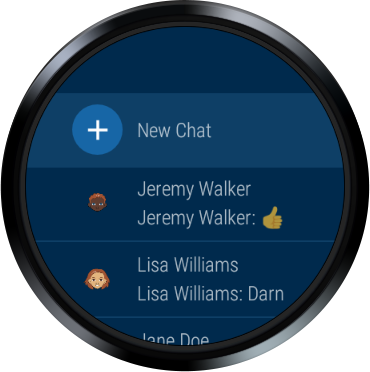
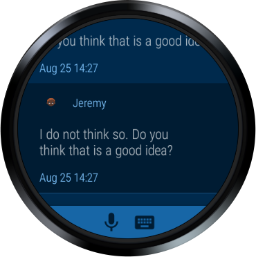
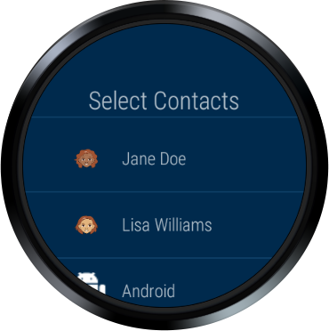

Android WearMessagingApp Sample
===================================

Sample demonstrating how to build a messaging app with the following features: contacts list,
chat list, send messages, message style notification, and sign-in with Google.

Introduction
------------

Getting Started
---------------

This project demonstrates Google Sign-in. You will need to follow the setup instructions for
integrating Google Sign-in into an Android app at the link below. Remember to use the package name
com.example.android.wearable.wear.messaging when configuring your project and credentials, or
otherwise modify the sample appropriately if you want to use a different package name.

https://developers.google.com/identity/sign-in/android/start-integrating

After you finish setting up the ___google-services.json___ file for Google Sign-in, update the
___strings.xml___ file for the string value ___default\_web\_client\_id___ to the value for the
OAuth web client id created.

Features
---------------
The project demonstrates the following features:

- Chat list
- Contacts list
- Authentication with Google
- Sending a chat message
- Receiving a chat message
- Replying from a notification

Each feature is contained in it's own package:

- _com.example.android.wearable.wear.messaging.____chat___
    - Displays a conversation
    - Handles incoming messages from a mocked back end server.
    - Replies to messages from a notification
- _com.example.android.wearable.wear.messaging.____chatlist___
    - Displays all of the conversations you are involved in.
- _com.example.android.wearable.wear.messaging.____contacts___
    - Displays a list your contacts. In this sample, the contacts are mocked out. You will want to
    replace the backing datasource with your own contacts solution.
- _com.example.android.wearable.wear.messaging.____mock___
    - A local mock database.
- _com.example.android.wearable.wear.messaging.____model___
    - Objects that are displayed in the UI. These objects also act as entities and are persisted in
    the mock database.

To see other examples of Google Sign-in, check out the [Android Wear Google Sign-In Sample][1].

To see other examples of notifications, check out the [Android WearNotifications Sample][2]

[1]: https://github.com/googlesamples/android-WearStandaloneGoogleSignIn
[2]: https://github.com/googlesamples/android-WearNotifications

Pre-requisites
--------------

- Android SDK 27
- Android Build Tools v27.0.2
- Android Support Repository

Screenshots
-------------

   

Getting Started
---------------

This sample uses the Gradle build system. To build this project, use the
"gradlew build" command or use "Import Project" in Android Studio.

Support
-------

- Google+ Community: https://plus.google.com/communities/105153134372062985968
- Stack Overflow: http://stackoverflow.com/questions/tagged/android

If you've found an error in this sample, please file an issue:
https://github.com/googlesamples/android-WearMessagingApp

Patches are encouraged, and may be submitted by forking this project and
submitting a pull request through GitHub. Please see CONTRIBUTING.md for more details.

License
-------

Copyright 2017 The Android Open Source Project, Inc.

Licensed to the Apache Software Foundation (ASF) under one or more contributor
license agreements.  See the NOTICE file distributed with this work for
additional information regarding copyright ownership.  The ASF licenses this
file to you under the Apache License, Version 2.0 (the "License"); you may not
use this file except in compliance with the License.  You may obtain a copy of
the License at

http://www.apache.org/licenses/LICENSE-2.0

Unless required by applicable law or agreed to in writing, software
distributed under the License is distributed on an "AS IS" BASIS, WITHOUT
WARRANTIES OR CONDITIONS OF ANY KIND, either express or implied.  See the
License for the specific language governing permissions and limitations under
the License.
