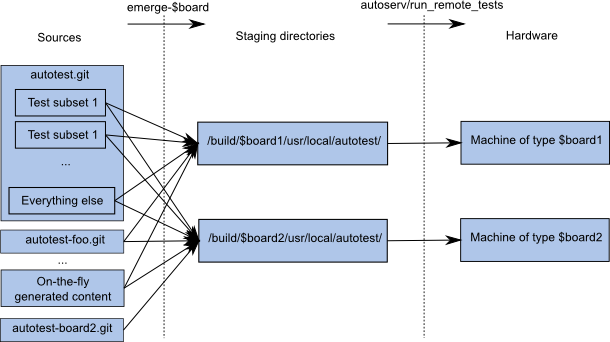

# Autotest for Chromium OS developers

[TOC]

## Useful documents

[Autotest documentation on GitHub](https://github.com/autotest/autotest/wiki/AutotestApi):
This would be a good read if you want to familiarize yourself with the basic
Autotest concepts.

[Gentoo Portage ebuild/eclass Information](http://www.gentoo.org/proj/en/devrel/handbook/handbook.xml?part=2):
Getting to know the package build system we use.

[ChromiumOS specific Portage FAQ](http://www.chromium.org/chromium-os/how-tos-and-troubleshooting/portage-build-faq):
Learning something about the way we use portage.

## Autotest and ebuild workflow

To familiarize with autotest concepts, you should start with the upstream
Autotest documentation at: https://github.com/autotest/autotest/wiki/AutotestApi

The rest of this document is going to use some terms and only explain them
vaguely.

### Overview

At a high level, tests are organized in test cases, each test case being either
server or client, with one main .py file named the same as the test case, and
one or more control files. In order to be able to perform all tasks on a given
test, autotest expects tests to be placed in a monolithic file structure
of:

-   `/client/tests/`
-   `/client/site_tests/`
-   `/server/tests/`
-   `/server/site_tests/`

Each test directory has to have at least a control file, but typically also has
a main job module (named the same as the test case). Furthermore, if it needs
any additional files checked in, they are typically placed in a `files/`
directory, and separate projects that can be built with a Makefile inside the
`src/` directory.

Due to structural limitations in Chromium OS, it is not possible to store all
test cases in this structure in a single large source repository as upstream
autotest source would (placed at `third_party/autotest/files/` in Chromium OS).
In particular, the following has been required in the past:

-   Having confidential (publicly inaccessible) tests or generally per-test ACLs
    for sharing only with a particular partner only.
-   Storing test cases along with the project they wrap around, because the test
    requires binaries built as a by-product of the project’s own build system.
    (e.g.  chrome or tpm tests)

Furthermore, it has been desired to generally build everything that is not
strongly ordered in parallel, significantly decreasing build times. That,
however, requires proper dependency tree declaration and being able to specify
which test cases require what dependencies, in addition to being able to
process different "independent" parts of a single source repository in
parallel.

This leads to the ebuild workflow, which generally allows compositing any
number of sources in any format into a single monolithic tree, whose contents
depend on build parameters.



This allows using standard autotest workflow without any change, however,
unlike what upstream does, the tests aren’t run directly from the source
repository, rather from a staging read-only install location. This leads to
certain differences in workflow:

-   Source may live in an arbitrary location or can be generated on the fly.
    Anything that can be created as an ebuild (shell script) can be a test source.
    (cros-workon may be utilised, introducing a fairly standard Chromium OS
    project workflow)
-   The staging location (`/build/${board}/usr/local/autotest/`) may not be
    modified; if one wants to modify it, they have to find the source to it
    (using other tools, see FAQ).
-   Propagating source changes requires an emerge step.

### Ebuild setup, autotest eclass

**NOTE**: This assumes some basic knowledge of how ebuilds in Chromium OS work.
Further documentation is available at http://www.chromium.org/chromium-os/how-tos-and-troubleshooting/portage-build-faq

An **autotest ebuild** is an ebuild that produces test cases and installs them into
the staging area. It has three general tasks:

-   Obtain the source - This is generally (but not necessarily) provided by
    ‘cros-workon’ eclass. It could also work with the more standard tarball
    SRC_URI pathway or generally any shell code executed in `src_unpack()`.
-   Prepare test cases - This includes, but is not limited to preprocessing any
    source, copying source files or intermediate binaries into the expected
    locations, where they will be taken over by autotest code, specifically the
    `setup()` function of the appropriate test. Typically, this is not needed.
-   Call autotest to "build" all sources and subsequently install them - This
    should be done exclusively by inheriting the **autotest eclass**, which
    bundles up all the necessary code to install into the intermediate location.

**Autotest eclass** is inherited by all autotest ebuilds, only requires a
number of variables specified and works by itself otherwise. Most variables
describe the locations and listings of work that needs to be done:

-   Location variables define the paths to directories containing the test
files:

    -   `AUTOTEST_{CLIENT,SERVER}_{TESTS,SITE_TESTS}`
    -   `AUTOTEST_{DEPS,PROFILERS,CONFIG}`

    These typically only need to be specified if they differ from the defaults
    (which follow the upstream directory structure)

-   List variables (`AUTOTEST_*_LIST`) define the list of deps, profilers,
    configs that should be handled by this ebuild.
-   IUSE test list specification TESTS=, is a USE_EXPANDed specification of
    tests managed by the given ebuild. By virtue of being an IUSE variable, all
    of the options are visible as USE flag toggles while building the ebuild,
    unlike with list variables which are a given and the ebuild has to be
    modified for those to change.

Each ebuild usually operates on a single source repository. That does not
always have to hold true, however, and in case of autotest, many ebuilds check
out the sources of the same source repository (*autotest.git*). Invariably, this
means that they have to be careful to not install the same files and split the
sources between themselves to avoid file install collisions.
If more than one autotest ebuild operates on the same source repository, they
**have to** use the above variables to define mutually exclusive slices in order
to not collide during installation. Generally, if we have a source repository
with client site_tests A and B, you can have either:

-   one ebuild with IUSE_TESTS="+tests_A +tests_B"
-   two different ebuilds, one with IUSE_TESTS="+tests_A", the other with
    IUSE_TESTS="+tests_B"

As soon as an overlap between ebuilds happens, either an outside mechanism has
to ensure the overlapping tests are never enabled at the same time, or file
collisions happen.


## Building tests

Fundamentally, a test has two main phases:

-   `run_*()` - This is is the main part that performs all testing and is
    invoked by the control files, once or repeatedly.
-   `setup()` - This function, present in the test case’s main .py file is
    supposed to prepare the test for running. This includes building any
    binaries, initializing data, etc.

During building using emerge, autotest will call a `setup()` function of all
test cases/deps involved. This is supposed to prepare everything. Typically,
this will invoke make on a Makefile present in the test’s src/ directory, but
can involve any other transformation of sources (also be empty if there’s
nothing to build).
**Note**, however, that `setup()` is implicitly called many times as test
initialization even during `run_*()` step, so it should be a noop on reentry
that merely verifies everything is in order.

Unlike `run_*()` functions, `setup()` gets called both during the prepare phase
which happens on the **host and target alike**. This creates a problem with
code that is being depended on or directly executed during `setup()`. Python
modules that are imported in any pathway leading to `setup()` are needed both
in the host chroot and on the target board to properly support the test. Any
binaries would need to be compiled using the host compiler and either ensured
that they will be skipped on the target (incremental `setup()` runs) or
cross-compiled again and dynamically chosen while running on target.

**More importantly**, in Chromium OS scenario, doing any write operations
inside the `setup()` function will lead to **access denied failures**, because
tests are being run from the intermediate read-only location.

Given the above, building is as easy as **emerge**-ing the autotest ebuild that
contains our test.
```
$ emerge-${board} ${test_ebuild}
```

*Currently, tests are organized within these notable ebuilds*: (see
[FAQ](#Q1_What-autotest-ebuilds-are-out-there_) full list):

-   chromeos-base/autotest-tests - The main ebuild handling most of autotest.git
    repository and its client and server tests.
-   chromeos-base/autotest-tests-* - Various ebuilds that build other parts of
    autotest.git
-   chromeos-base/chromeos-chrome - chrome tests; the tests that are part of
    chrome

### Building tests selectively

Test cases built by ebuilds generally come in large bundles. Sometimes, only a
subset, or generally a different set of the tests provided by a given ebuild is
desired. That is achieved using a
[USE_EXPANDed](http://devmanual.gentoo.org/general-concepts/use-flags/index.html)
flag called TESTS.

All USE flags (and therefore tests) have a default state, either enabled (+) or
disabled (-), specified directly in the ebuild, that can be manually overridden
from the commandline. There are two ways to do that.

-   Non-Incremental - Simply override the default selection by an entirely new
    selection, ignoring the defaults. This is useful if you develop a single
    test and don’t want to waste time building the others.

        $ TESTS="test1 test2" emerge-${board} ${ebuild}

-   Incremental - All USE_EXPAND flags are also accessible as USE flags, with
    the appropriate prefix, and can be used incrementally to selectively
    enable/disable tests in addition to the defaults. This can be useful if you
    aim to enable a test that is disabled by default and want to test locally.

        $ USE="test_to_be_enabled -test_to_be_disabled" emerge-${board} \
          ${ebuild}

For operations across all tests, following incremental USE wildcard is
supported by portage: "tests_*" to select all tests at once (or - to
de-select).

**NOTE**: Both Incremental and Non-Incremental methods can be set/overriden by
(in this order): the ebuild (default values), make.profile, make.conf,
/etc/portage, commandline (see above). That means that any settings provided on
the emerge commandline override everything else.

## Running tests

**NOTE**: In order to run tests on your device, it needs to have a
[test-enabled image](#W4_Create-and-run-a-test-enabled-image-on-your-device).

When running tests, fundamentally, you want to either:

-   Run sets of tests manually - Use case: Developing test cases

    Take your local test sources, modify them, and then attempt to run them on a
    target machine using autotest. You are generally responsible for making sure
    that the machine is imaged to a test image, and the image contains all the
    dependencies needed to support your tests.

-   Verify a given image - Use case: Developing the projects subject to testing

    Take an image, re-image the target device and run a test suite on it. This
    requires either use of build-time autotest artifacts or their reproduction
    by not modifying or resyncing your sources after an image has been built.

### Running tests on a machine

Autotests are run with a tool called
[test_that](https://chromium.googlesource.com/chromiumos/third_party/autotest/+/refs/heads/master/docs/test-that.md).

### Running tests in a VM - cros_run_vm_tests

VM tests are conveniently wrapped into a script `cros_run_vm_tests` that sets up
the VM using a given image and then calls `test_that`. This is run by builders
to test using the Smoke suite.

If you want to run your tests on the VM (see
[here](https://www.chromium.org/chromium-os/how-tos-and-troubleshooting/running-chromeos-image-under-virtual-machines) for basic instructions for
setting up KVM with cros images) be aware of the following:

-   `cros_run_vm_test` starts up a VM and runs autotests using the port
-   specified (defaults to 9222).  As an example:

        $ ./bin/cros_run_vm_test --test_case=suite_Smoke \
        --image_path=<my_image_to_start or don't set to use most recent build> \
        --board=x86-generic

-   The emulator command line redirects localhost port 9222 to the emulated
    machine's port 22 to allow you to ssh into the emulator. For Chromium OS to
    actually listen on this port you must append the `--test_image` parameter
    when you run the `./image_to_vm.sh` script, or perhaps run the
    `mod_image_for_test.sh` script instead.
-   You can then run tests on the correct ssh port with something like

        $ test_that --board=x86-generic localhost:9222 'f:.*platform_BootPerf/control'

-   To set the sudo password run set_shared_user_password. Then within the
    emulator you can press Ctrl-Alt-T to get a terminal, and sudo using this
    password. This will also allow you to ssh into the unit with, e.g.

        $ ssh -p 9222 root@localhost

-   Warning: After
    [crbug/710629](https://bugs.chromium.org/p/chromium/issues/detail?id=710629),
    'betty' is the only board regularly run through pre-CQ and CQ VMTest and so
    is the most likely to work at ToT. 'betty' is based on 'amd64-generic',
    though, so 'amd64-generic' is likely to also work for most (non-ARC) tests.


## Result log layout structure

For information regarding the layout structure please refer to the following:
[autotest-results-logs](https://www.chromium.org/chromium-os/testing/test-code-labs/autotest-client-tests/autotest-results-logs)

### Interpreting test results

Running autotest will result in a lot of information going by which is probably
not too informative if you have not used autotest before.  At the end of the
`test_that` run, you will see a summary of pass/failure status, along with
performance results:

```
22:44:30 INFO | Using installation dir /home/autotest
22:44:30 ERROR| Could not install autotest from repos
22:44:32 INFO | Installation of autotest completed
22:44:32 INFO | GOOD  ----  Autotest.install timestamp=1263509072 localtime=Jan 14 22:44:32
22:44:33 INFO | Executing /home/autotest/bin/autotest /home/autotest/control phase 0
22:44:36 INFO | START  ---- ----  timestamp=1263509075 localtime=Jan 14 14:44:35
22:44:36 INFO |  START   sleeptest sleeptest timestamp=1263509076 localtime=Jan 14 14:44:36
22:44:36 INFO | Bundling /usr/local/autotest/client/tests/sleeptest into test-sleeptest.tar.bz2
22:44:40 INFO |   GOOD  sleeptest  sleeptest  timestamp=1263509079 localtime=Jan 14 14:44:39 completed successfully
22:44:40 INFO |   END GOOD  sleeptest sleeptest  timestamp=1263509079 localtime=Jan 14 14:44:39
22:44:42 INFO | END GOOD ---- ---- timestamp=1263509082 localtime=Jan 14 14:44:42
22:44:44 INFO | Client complete
22:44:45 INFO | Finished processing control file
```

`test_that` will leave around a temp directory populated with diagnostic information:

```
Finished running tests. Results can be found in /tmp/test_that_results_j8GoWH or /tmp/test_that_latest
```

This directory will contain a directory per test run.  Each directory contains
the logs pertaining to that test run.

In that directory some interesting files are:

${TEST}/debug/client.DEBUG - the most detailed output from running the
client-side test

### Running tests automatically, Suites

Suites provide a mechanism to group tests together in test groups. They also
serve as hooks for automated runs of tests verifying various builds. Most
importantly, that is the BVT (board verification tests) and Smoke (a subset of
BVT that can run in a VM).

Please refer to the [suites documentation](https://www.chromium.org/chromium-os/testing/test-suites).

## Writing and developing tests

### Writing a test

For understanding and writing the actual python code for autotest, please refer
to the [Developer FAQ](http://www.chromium.org/chromium-os/testing/autotest-developer-faq#TOC-Writing-Autotests)

Currently, all code should be placed in a standard layout inside the
autotest.git repository, unless otherwise is necessary for technical reasons.
Regardless, the following text assumes that code is placed in generally any
repository.

For a test to be fully functional in Chromium OS, it has to be associated with
an ebuild. It is generally possible to run tests without an ebuild using
`test_that` but discouraged, as the same will not function with other parts of
the system.

### Making a new test work with ebuilds

The choice of ebuild depends on the location of its sources. Structuring tests
into more smaller ebuilds (as opposed to one ebuild per source repository)
serves two purposes:

-   Categorisation - Grouping similar tests together, possibly with deps they
    use exclusively.
-   Parallelisation - Multiple independent ebuilds can build entirely in
    parallel.
-   Dependency tracking - Larger bundles of tests depend on more system
    packages without proper resolution which dependency belongs to which test.
    This also increases paralellism.

Current ebuild structure is largely a result of breaking off the biggest
blockers for parallelism, ie. tests depending on chrome or similar packages,
and as such, using any of the current ebuilds should be sufficient. (see FAQ
for listing of ebuilds)

After choosing the proper ebuild to add your test into, the test (in the form
“+tests_<testname>”) needs to be added to IUSE_TESTS list that all autotest
ebuilds have. Failing to do so will simply make ebuilds ignore your tests
entirely. As with all USE flags, prepending it with + means the test will be
enabled by default, and should be the default, unless you want to keep the test
experimental for your own use, or turn the USE flag on explicitly by other
means, eg. in a config for a particular board only.

Should a **new ebuild** be started, it should be added to
**chromeos-base/autotest-all** package, which is a meta-ebuild depending on all
autotest ebuild packages that can be built. autotest-all is used by the build
system to automatically build all tests that we have and therefore keep them
from randomly breaking.

### Deps

Autotest uses deps to provide a de-facto dependencies into the ecosystem. A dep
is a directory in ‘**client/deps**’ with a structure similar to a test case
without a control file. A test case that depends on a dep will invoke the dep’s
`setup()` function in its own `setup()` function and will be able to access the
files provided by the dep. Note that autotest deps have nothing to do with
system dependencies.

As the calls to a dep are internal autotest code, it is not possible to
automatically detect these and make them an inter-package dependencies on the
ebuild level. For that reason, deps should either be
[provided](#Ebuild-setup_autotest-eclass) by the same ebuild that builds test
that consume them, or ebuild dependencies need to be declared manually between
the dep ebuild and the test ebuild that uses it.  An **autotest-deponly**
eclass exists to provide solution for ebuilds that build only deps and no
tests. A number of deponly ebuilds already exist.

Common deps are:

-   chrome_test - Intending to use any of the test binaries produced by chrome.
-   pyauto_dep - Using pyauto for your code.

### Test naming conventions

Generally, the naming convention runs like this:

\<component>\_\<TestName\>

That convention names the directory containing the test code.  It also names
the .py file containing the test code, and the class of the Autotest test.

If there's only one control file, it's named control.  The test's NAME in the
control file is \<component\>_\<TestName\>, like the directory and .py
file.

If there are multiple control files for a test, they are named
control.\<testcase\>. These tests' NAMEs are then
\<component\>_\<TestName\>.\<testcase\>.

## Common workflows

### W1. Develop and iterate on a test

1.  Set up the environment.

        $ cd ~/trunk/src/third_party/autotest/files/
        $ export TESTS=”<the test cases to iterate on>”
        $ EBUILD=<the ebuild that contains TEST>
        $ board=<the board on which to develop>

2.  Ensure cros_workon is started

        $ cros_workon --board=${board} start ${EBUILD}
        $ repo sync # Necessary only if you use minilayout.

3.  Make modifications (on first run, you may want to just do 3,4 to verify
    everything works before you touch it \& break it)

        $ ...

4.  Build test (TESTS= is not necessary if you exported it before)

        $ emerge-$board $EBUILD

5.  Run test to make sure it works before you touch it

        $ test_that <machine IP> ${TESTS}

6.  Go to 2) to iterate
7.  Clean up environment

        $ cros_workon --board=${board} stop ${EBUILD}
        $ unset TESTS

### W2. Creating a test - steps and checklist

When creating a test, the following steps should be done/verified.

1.  Create the actual test directory, main test files/sources, at least one
    control file
2.  Find the appropriate ebuild package and start working on it:

        $ cros_workon --board=${board} start <package>

3.  Add the new test into the IUSE_TESTS list of 9999 ebuild
4.  Try building: (make sure it’s the 9999 version being built)

        $ TESTS=<test> emerge-$board <package>

5.  Try running:

        $ test_that <IP> <test>

6.  Iterate on 4,5 and modify source until happy with the initial version.
7.  Commit test source first, when it is safely in, commit the 9999 ebuild
    version change.
8.  Cleanup

         $ cros_workon --board=${board} stop <package>

### W3. Splitting autotest ebuild into two

Removing a test from one ebuild and adding to another in the same revision
causes portage file collisions unless counter-measures are taken. Generally,
some things routinely go wrong in this process, so this checklist should serve
to help that.

1.  We have ebuild **foo-0.0.1-r100** with **test** and would like to split
    that test off into ebuild **bar-0.0.1-r1**.
    Assume that:
    -   both ebuilds are using cros-workon (because it’s likely the case).
    -   foo is used globally (eg. autotest-all depends on it), rather than just
        some personal ebuild
2.  Remove **test** from foo-{0.0.1-r100,9999}; uprev foo-0.0.1-r100 (to -r101)
3.  Create bar-9999 (making a copy of foo and replacing IUSE_TESTS may be a good
    start), with IUSE_TESTS containing just the entry for **test**
4.  Verify package dependencies of test. Make bar-9999 only depend on what is
    needed for test, remove the dependencies from foo-9999, unless they are
    needed by tests that remained.
5.  Add a blocker. Since bar installs files owned by foo-0.0.1-r100 and earlier,
    the blocker’s format will be:

        RDEPEND="!<=foo-0.0.1-r100"

6.  Add a dependency to the new version of bar into
    chromeos-base/autotest-all-0.0.1

        RDEPEND="bar"

7.  Change the dependency of foo in chromeos-base/autotest-all-0.0.1 to be
    version locked to the new rev:

        RDEPEND=">foo-0.0.1-r100"

8.  Uprev (move) autotest-all-0.0.1-rX symlink by one.
9.  Publish all as the same change list, have it reviewed, push.

### W4. Create and run a test-enabled image on your device

1.  Choose which board you want to build for (we'll refer to this as ${BOARD},
    which is for example "x86-generic").
2.  Set up a proper portage build chroot setup.  Go through the normal process
    of setup_board if you haven't already.

        $ ./build_packages --board=${BOARD}

3.  Build test image.

        $ ./build_image --board=${BOARD} test

4.  Install the Chromium OS testing image to your target machine.  This is
    through the standard mechanisms: either USB, or by reimaging a device
    currently running a previously built Chromium OS image modded for test, or
    by entering the shell on the machine and forcing an auto update to your
    machine when it's running a dev server.  For clarity we'll walk through two
    common ways below, but if you already know about this, just do what you
    normally do.

    -   If you choose to use a USB boot, you first put the image on USB and run
        this from outside the chroot.

            $ ./image_to_usb.sh --to /dev/sdX --board=${BOARD} \
              --image_name=chromiumos_test_image.bin

    -   Alternatively, if you happen to already have a machine running an image
        modified for test and you know its IP address (${REMOTE_IP}), you can
        avoid using a USB key and reimage it with a freshly built image by
        running this from outside the chroot:

            $ ./image_to_live.sh --remote=${REMOTE_IP} \
              --image=`./get_latest_image.sh \
              --board=${BOARD}`/chromiumos_test_image.bin

This will automatically start dev server, ssh to your machine, cause it to
update to from that dev server using memento_updater, reboot, wait for reboot,
print out the new version updated to, and shut down your dev server.

## Troubleshooting/FAQ

### Q1: What autotest ebuilds are out there?

Note that the list of ebuilds may differ per board, as each board has
potentially different list of overlays. To find all autotest ebuilds for board
foo, you can run:
```
$ board=foo
$ for dir in $(portageq-${board} envvar PORTDIR_OVERLAY); do
     find . -name '*.ebuild' | xargs grep "inherit.*autotest" | grep "9999" | \
     cut -f1 -d: | \
     sed -e 's/.*\/\([^/]*\)\/\([^/]*\)\/.*\.ebuild/\1\/\2/'
   done
```
(Getting: "WARNING: 'portageq envvar PORTDIR_OVERLAY' is deprecated. Use
'portageq repositories_configuration' instead." Please fix documentation.)

### Q2: I see a test of the name ‘greattests_TestsEverything’ in build output/logs/whatever! How do I find which ebuild builds it?

All ebuilds have lists of tests exported as **USE_EXPANDed** lists called
**TESTS**. An
expanded use can be searched for in the same way as other use flags, but with
the appropriate prefix, in this case, you would search for
**tests_greattests_TestsEverything**’:
```
$ use_search=tests_greattests_TestsEverything
$ equery-$board hasuse $use_search
 * Searching for USE flag tests_greattests_TestsEverything ...
 * [I-O] [  ] some_ebuild_package_name:0
```

This will however only work on ebuilds which are **already installed**, ie.
their potentially outdated versions.
**Alternatively**, you can run a pretended emerge (emerge -p) of all autotest
ebuilds and scan the output.
```
$ emerge -p ${all_ebuilds_from_Q1} |grep -C 10 “${use_search}”
```

### Q3: I have an ebuild ‘foo’, where are its sources?

Generally speaking, one has to look at the ebuild source to figure that
question out (and it shouldn’t be hard). However, all present autotest ebuilds
(at the time of this writing) are also ‘cros-workon’, and for those, this
should always work:
```
$ ebuild_search=foo
$ ebuild $(equery-$board which $ebuild_search) info
CROS_WORKON_SRCDIR=”/home/you/trunk/src/third_party/foo”
CROS_WORKON_PROJECT=”chromiumos/third_party/foo”
```

### Q4: I have an ebuild, what tests does it build?

You can run a pretended emerge on the ebuild and observe the ‘TESTS=’
statement:
```
$ ebuild_name=foo
$ emerge-$board -pv ${ebuild_name}
These are the packages that would be merged, in order:

Calculating dependencies... done!
[ebuild   R   ] foo-foo_version to /build/$board/ USE="autox hardened tpmtools
xset -buildcheck -opengles" TESTS="enabled_test1 enabled_test2 ... enabled_testN
-disabled_test1 ...disabled_testN" 0 kB [1]
```

Alternately, you can use equery, which will list tests with the USE_EXPAND
prefix:
```
$ equery-$board uses ${ebuild_name}
[ Legend : U - final flag setting for installation]
[        : I - package is installed with flag     ]
[ Colors : set, unset                             ]
 * Found these USE flags for chromeos-base/autotest-tests-9999:
 U I
 + + autotest                                    : <unknown>
 + + autotest                                    : <unknown>
 + + autox                                       : <unknown>
 + + buildcheck                                  : <unknown>
 + + hardened                                    : activate default security enhancements for toolchain (gcc, glibc, binutils)
 - - opengles                                    : <unknown>
 + + tests_enabled_test                     : <unknown>
 - - tests_disabled_test                      : <unknown>
```

### Q5: I’m working on some test sources, how do I know which ebuilds to cros_workon start in order to properly propagate?

You should ‘workon’ and always cros_workon start all ebuilds that have files
that you touched.  If you’re interested in a particular file/directory, that
is installed in `/build/$board/usr/local/autotest/` and would like know which
package has provided that file, you can use equery:

```
$ equery-$board belongs /build/${board}/usr/local/autotest/client/site_tests/foo_bar/foo_bar.py
 * Searching for <filename> ...
chromeos-base/autotest-tests-9999 (<filename>)
```

DON’T forget to do equery-$board. Just equery will also work, only never
return anything useful.

As a rule of thumb, if you work on anything from the core autotest framework or
shared libraries (anything besides
{server,client}/{test,site_tests,deps,profilers,config}), it belongs to
chromeos-base/autotest. Individual test case will each belong to a particular
ebuild, see Q2.

It is important to cros_workon start every ebuild involved.

### Q6: I created a test, added it into ebuild, emerged it, and I’m getting access denied failures. What did I do wrong?

Your test’s `setup()` function (which runs on the host before being uploaded) is
probably trying to write into the read-only intermediate location. See
[explanation](#Building-tests).

