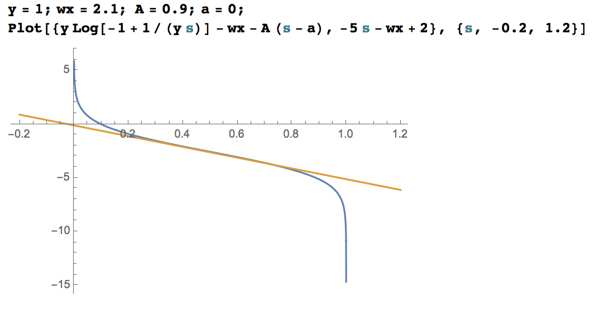
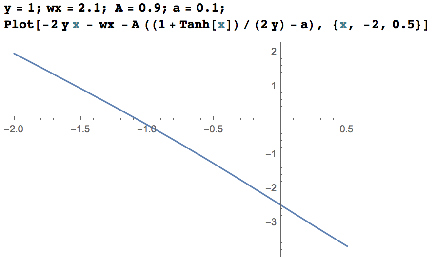
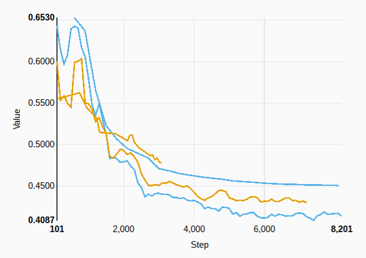

$$ \def\a{\alpha} \def\d{\Delta\a} \def\l{\ell} \def\P{\mathcal{P}}$$

# Distributed SDCA

We want to minimize on $$K$$ machines the following objective

$$ P(w) = \frac{1}{n}\sum_{i=1}^n \l_i(x_i^T w)+\lambda g(w) $$

By Fenchel duality, this is equivalent to maximizing its dual

$$ D(\a) = \frac{1}{n} \left(\sum_{i=1}^n -\l_i^\star(-\a_i)\right) -\lambda g^\star\left(\tfrac{1}{\lambda n} X\a\right) $$

which can be done very efficiently on a single machine with SDCA [3].

Here, $$f^\star$$ denotes the convex dual of a convex function $$f$$, $$\l_i$$
is the loss for the example $$i$$, $$n$$ is the total number of examples and
$$\lambda n$$ is the L2 parameter.

Following [1,2], we use a data partition $$\P_1,\dots,\P_K$$ of
$$\{1,2,\dots,n\}$$ such that $$\P_k$$ contains the examples on machine $$k$$.
For an $$n$$-dimensional vector $$h$$, we denote by $$h_{[k]}$$ the
$$n$$-dimensional vector restricted to the machine $$k$$: $$(h_{[k]})_i = h_i$$
if $$i\in\P_k$$ and $$0$$ otherwise.

## CoCoA+ Local Solver

The local subproblem on machine $$k$$ is [1, 2]

$$ \max_{\d_{[k]}} \mathcal{G}^{\sigma}_k (\d_{[k]}) $$

with

$$
\mathcal{G}^{\sigma}_k (\d_{[k]}) =
-\frac{1}{n} \sum_{i\in\P_k}\l_i^\star(-\a_i-(\d_{[k]})_i) -\frac{1}{n} w^T X
\d_{[k]}- \frac{\lambda}{2}\sigma \left\| \frac{1}{\lambda n} X \d_{[k]}
\right\|^2 $$

$$\sigma$$ is a parameter the measures the difficulty of the data partition.
CoCoA+ makes the choice

$$ \sigma = K $$

This decision is motivated in [2] and shown to be more efficient than the
previous CoCoA choice ($$\sigma = 1$$).

For one example, the problem is simply

$$ \max_{\d} \left\{ D_i(\d) = -\l_i^\star(-(\a_i+\d)) - \bar{y}_i \d - \frac{A}{2} \d^2 \right\} $$

where we have defined $$A=\sigma X_i^2/(\lambda n) $$ and $$ \bar{y}_i = w^T X_i
$$.

To take into account example weights, it suffices to replace $$\frac{1}{n}$$ by
$$\frac{s_i}{S}$$ where $$s_i$$ is the weight of the i-th example and $$S=\sum
s_i$$. For our problem, this will only change $$A$$ to $$\sigma
X_i^2s_i/(\lambda S) $$.

### Hinge Loss

Hinge loss is given by $$ \l_i(u) = \max(0,1-y u) $$. Its convex dual is $$
\l_i^\star(-a) = -a y $$ with the constraint $$ a y\in [0,1] $$.

The solution for the update is given explicitly in [3]. To derive the CoCoA+
formulation, we replace $$\lambda$$ by $$\frac{\lambda}{\sigma}$$. This gives

$$ \d = \frac{y - \bar{y}}{A} $$

with the restriction that $$y(\a+\d)\in(0,1)$$.

### Smooth Hinge Loss

Smooth hinge loss is given by

$$ \l_i(u) =
\begin{cases}
0 \:\:\: & y_i u \geq 1\\
1-y_i u -\gamma/2 \:\:\:& y_i u \leq1-\gamma \\
\frac{(1-y_i u)^2}{2\gamma} & \text{otherwise}
\end{cases} $$

The optimal $$\d$$ is computed to be

$$\d = \frac{y-\bar{y}-\gamma\a}{A+\gamma} $$

with the restriction that $$y(\a+\d)\in(0,1)$$. We see that we recover standard
hinge update for $$\gamma = 0$$. The details of the computation can be found in
Appendix.

### Squared Loss

Squared loss is $$ \l_i(u) = \frac{1}{2}(u-y)^2 $$ with dual $$ \l_i^\star(v) =
\frac{1}{2}v^2+y v$$.

The closed form solution for squared loss is given in [4]. By replacing again
$$\lambda$$ by $$\frac{\lambda}{\sigma}$$ we obtain

$$ \d = -\frac{\a + w^T X_i - y}{1 + \frac{\sigma X_i^2}{2 \lambda n}} $$

### Logistic loss

Logistic loss is $$ \l_i(u) = \log (1+e^{-uy_i}) $$ and its dual is

$$ \l_i^\star(v) = -vy_i\log(-vy_i) + (1+vy_i)
\log(1+vy_i) $$

The label $$y_i$$ is $$\pm 1$$ and the dual loss is only defined for $$ -y_i
v\in (0,1) $$. We then have the constraint

$$  y_i (\a+\d) \in (0,1) $$

The problem of finding the maximum of $$ D(\d) $$ can be reformulated as the
problem of finding the unique zero of its derivative. Newton method works well
for finding the zero of $$ D'(\d) $$ but can be a bit unstable due to the
constraint requiring $$y_i(\a+\d)$$ be in the range $$(0,1)$$ (more on this
below).

To avoid this problem, we make the following change of variable

$$ y(\a+\d) = \frac{1}{2}(1+\tanh x) $$

This enforces the constraint and is well suited because the objective derivative
has the following simple form:

$$ D' = H(x) = -2y x - \bar{y} + A\a -\frac{A}{2y}(1+\tanh x) $$

with derivative

$$ H'(x) = -2y - \frac{A}{2y}(1-\tanh^2 x) $$

This function is always positive or always negative so that $$H$$ is strictly
monotonic.

We can start Newton algorithm at $$x_0=0$$ which corresponds to $$ y(\a+\d) =
0.5 $$. A Newton step is given by

$$x_{k+1} = x_k - \frac{H(x_k)}{H'(x_k)} $$

The convergence is very fast with the modified function and 5 Newton steps
should be largely enough.

##### Plots and experiments

Below is a plot where standard Newton will be unstable. The starting point is
$$x=0.5$$ and we leave the definition interval after the first step (the orange
line is the tangent at the starting point). Newton algorithm will return 0 where
the real zero is at 0.10.

The same plot for the modified function (with the same parameters) is almost a
straight line. The starting point is $$x=0$$ and we see that the convergence is
fast.

We see that the result will be $$ \frac{1+\tanh(-1.1)}{2} \sim 0.10$$ as
expected.

On criteo dataset, the usual Newton method goes out of range for a small (but
non negligible) fraction of the examples. The returned dual in these cases will
be $$0$$ or $$\pm 1$$. The modified Newton algorithm always find the true zero
and achieves a better log loss.

The blue lines represent the modified Newton (evaluation and training) and the
orange line is the normal Newton algorithm (training).

TODO(vgodet): Update the plot with eval_continuous for Newton

Note: Newton seems to converge faster at the beginning because it is taking more
aggressive steps when going out-of-range.

##### Proof of convergence

The second derivative of $$H$$

$$ H''(x) = \frac{A}{y} \tanh x (1-\tanh^2 x) $$

is bounded and quadratic convergence should be guaranteed if we are close enough
to the solution (see
https://en.wikipedia.org/wiki/Newton%27s_method#Proof_of_quadratic_convergence_for_Newton.27s_iterative_method
for the proof).

However we can't really know if we are close to the zero. To prove the
convergence in any cases, we can use Kantovitch Theorem (reviewed in [5]). The
sufficient condition to have convergence is that we start at a point $$ x_0 $$
such that

$$
\left|\frac{4A H(x_0)}{H'(x_0)^2} \right|\leq 1
$$

If $$ A$$ is not small, the starting point $$x_0 = 0$$ doesn't satisfy this
condition and we may solve the above inequality to find a starting point which
does.

However, in practice, convergence with $$x_0 = 0$$ always happens (tested for a
sample of generic values for the parameters).

### References

[1] C. Ma et al., Adding vs. Averaging in Distributed Primal-Dual Optimization,
arXiv:1502.03508, 2015

[2] C. Ma et al., Distributed Optimization with Arbitrary Local Solvers,
arxiv:1512.04039, 2015

[3] S. Shalev-Shwartz, T. Zhang, Stochastic Dual Coordinate Ascent Methods for
Regularized Loss Minimization, 2013

[4] S. Shalev-Shwartz, T. Zhang, Accelerated Proximal Stochastic Dual Coordinate
Ascent for Regularized Loss Minimization, 2013

[5] A. Galantai, The theory of Newton’s method, 2000

## Appendix

##### Dual computation for smooth hinge loss

We want to compute $$\l^\star(v) = \max_u [ uv-\l(u) ] $$ where $$\l$$ is smooth
hinge loss. We thus have to solve $$v=\l'(u)$$. The derivative of smooth hinge
loss is given by

$$ \l'(u) =
\begin{cases}
0 \:\:\: & y_i u \geq 1\\
-y \:\:\:& y_i u \leq1-\gamma \\
\frac{u-y}{\gamma} & \text{otherwise}
\end{cases} $$

By solving for $$v$$, we find the dual of smooth hinge loss as

$$ \l^\star(v) = yv + \frac{\gamma}{2}v^2 $$

with the restriction $$ yv \in (0,1) $$.

Now, we can now minimize the dual objective with respect to $$\d$$

$$ D(\a+\d) = -\l^\star(-\a-\d)-\bar{y}\d-\frac{A}{2} \d^2 $$

which gives the expected result

$$\d = \frac{y-\bar{y}-\gamma\a}{A+\gamma} $$

with the constraint $$ y(\a+\d) \in (0,1)$$.
