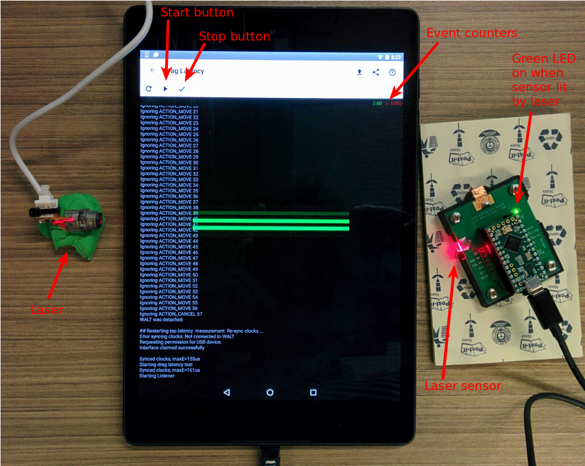
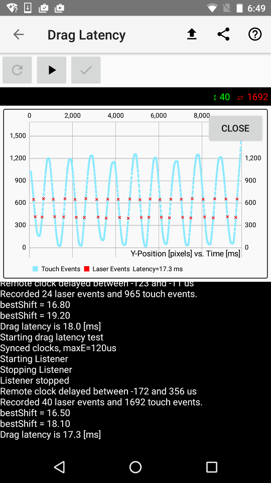

## Drag / scroll latency

For detailed instructions on how to perform the measurement refer to the [usage doc](usage/WALT_usage.md#dragscroll-latency).

For drag (or scroll) latency WALT uses a laser that shines across the touch device and hits a detector on the
other side. The microcontroller monitors the state of the laser detector and reports (over usb) when
the laser beam is broken. A finger dragged back and forth on a touchpad or touch screen
and interrupts a laser beam. Touch events from the pad and laser events are then processed together
to deduce the delay.

A [video](https://plus.google.com/+FrancoisBeaufort/posts/XctAif2nv4U) showing the measurement
performed using a robotic stylus.

Sample measurements

| Device       | OS version     | Drag latency [ms]|
| :---         | :---           |             ---: | 
| Nexus 5      | M4B30Z (6.0.1) |             18.4 | 
| Nexus 5X     | NRD91P (7.0)   |             18.9 | 
| Nexus 7      | LMY47Q (5.1)   |             35.8 |
| Nexus 9      | MMB29K (6.0.1) |             10.2 |

## Drag latency calculation

The app collects all the motion events reported by Android with their coordinates and timestamps. The plot on the screenshot below show the vertical coordinate as a function of time as seen by the app _y_(_t_).

The red 'x' marks are points where the finger was at times _ti_ when the finger went into or out of the laser beam. The y distance between the two lines of x marks is roughly the thickness of the finger. For now consider only one of the lines, e.g. the upper one.

Now imagine that the clocks timestamping the touch and the laser events diverge a little (this divergence is the latency we want to measure). The red 'x' marks would move along the graph. But half of them would move up and half down (corresponding to direction of the finger movement in that point) and therefore they would diverge in opposite directions from the relatively straight horizontal line you see on the screenshot.

The WALT app finds a shift _S_ such that the standard deviation of _y_( _ti_ + _S_) is minimal - that is the 'x' marks are as close as possible to a horizontal straight line on the graph below. The reported number is the average of the two time shifts calculated separately for the upper and the lower lines (corresponding to two sides of the finger).

This calculation that only looks at the _y_ coordinate assumes the laser beam is parallel to the _x_ axis and prefers no motion of the finger in the _x_ direction.

The Python script used for ChromeOS employs a 2D extension of this method (implemented in [minimization.py](/pywalt/minimization.py)). This has the opposite requirement of some considerable spread of the collected _x_ coordinates.

